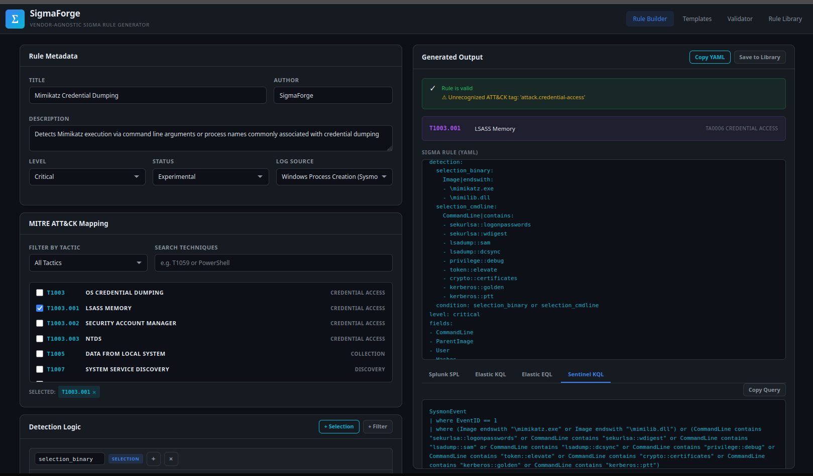
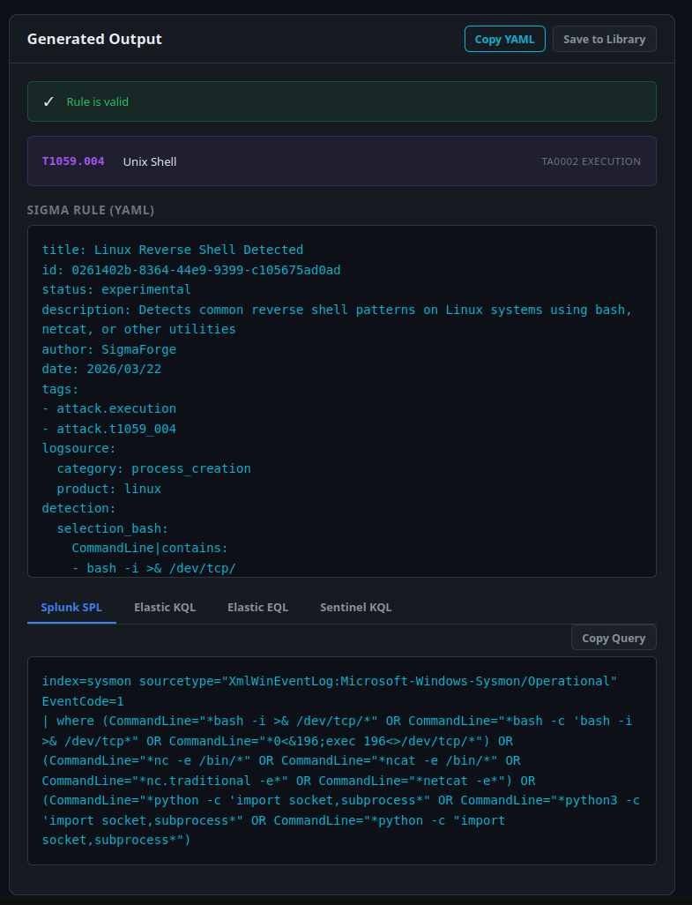
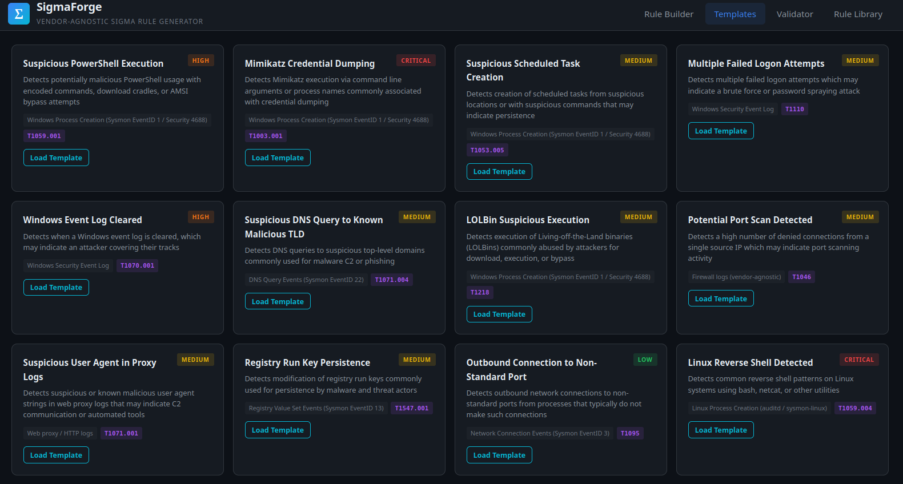
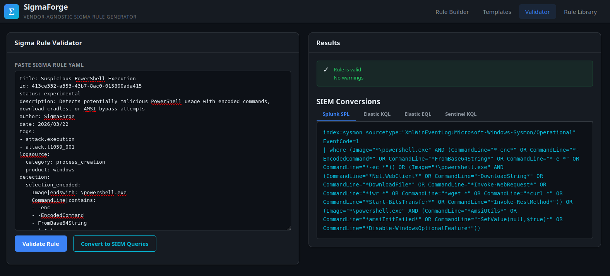
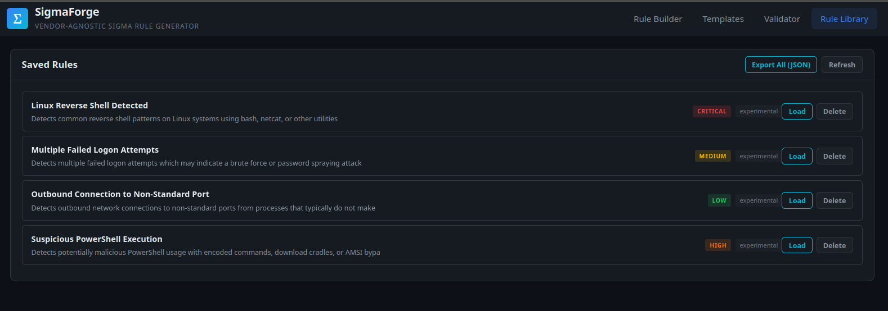

<div align="center">

# SigmaForge

### Vendor-Agnostic Sigma Rule Generator

[](https://python.org)
[](https://flask.palletsprojects.com)
[](LICENSE)
[](https://sigmahq.io)

</div>

---

## Overview

SigmaForge is a detection rule authoring tool that generates, validates, and converts Sigma rules to six SIEM query languages plus Detection-as-Code JSON. It ships as a Flask web UI and a standalone CLI. The conversion engine is custom-built — there is no pySigma dependency, which means the Wazuh XML backend produces valid XML out of the box (pySigma has no native Wazuh backend).

**Backends** (`SIEMConverter.convert`):

| Backend key | Output format |
|-------------|---------------|
| `splunk` | Splunk SPL with index/sourcetype prefix |
| `elastic` | Elastic Lucene KQL |
| `eql` | Elastic EQL |
| `sentinel` | Microsoft Sentinel KQL |
| `wazuh` | Wazuh XML `<group>` / `<rule>` block |
| `qradar` | QRadar AQL (`SELECT * FROM events … LAST 24 HOURS`) |
| `dac_json` | Detection-as-Code normalized JSON |

**Log sources** (`LOG_SOURCES`):

| Key | Description |
|-----|-------------|
| `process_creation` | Process Creation — Sysmon EID 1 / Security EID 4688 |
| `windows_security` | Windows Security Event Log |
| `sysmon` | Sysmon Operational Log (all event types) |
| `powershell` | PowerShell Script Block / Module Logging |
| `powershell_classic` | Windows PowerShell (Classic) Event Log |
| `dns_query` | DNS Query Events — Sysmon EID 22 |
| `network_connection` | Network Connection Events — Sysmon EID 3 |
| `file_event` | File Creation / Modification Events — Sysmon EID 11 |
| `registry_event` | Registry Value Set Events — Sysmon EID 13 |
| `firewall` | Firewall logs (vendor-agnostic) |
| `proxy` | Web proxy / HTTP logs |
| `linux_process` | Linux Process Creation (auditd / sysmon-linux) |
| `linux_auth` | Linux Authentication Logs (`/var/log/auth.log`) |

---

## Screenshots

### Rule Builder
*Build Sigma rules visually with MITRE ATT&CK mapping and detection logic*



### Generated Output
*YAML output with Splunk SPL, Elastic KQL, EQL, Sentinel KQL, Wazuh XML, QRadar AQL, and DaC JSON conversions*



### Templates
*12 pre-built detection templates covering common attack techniques*



### Validator
*Paste any Sigma YAML for syntax checking and SIEM conversion*



### Rule Library
*Save, load, export, and manage generated rules*



---

## SOC Use Case

A SOC analyst encounters an alert they want to turn into a persistent detection. The workflow in SigmaForge:

**Scenario: Analyst sees Mimikatz-related activity in EDR telemetry**

1. Open the web UI Rule Builder or run the CLI `generate` command.
2. Set `logsource: process_creation`, level `critical`, MITRE technique `T1003.001`.
3. Add detection fields: `Image|endswith=\mimikatz.exe` and `CommandLine|contains=sekurlsa::logonpasswords`.
4. Click Generate — the rule produces valid Sigma YAML and simultaneous output for all six backends.
5. Copy the **Wazuh XML** tab output and drop it into `ossec.conf` or the Wazuh rules directory — the XML is ready to load, no post-processing.
6. Copy the **Splunk SPL** output and save it as a saved search or correlation rule in the SIEM.
7. Save the rule to the library via `POST /api/library/save`. It persists as a `.yml` file under `rules/`.

**Scenario: Analyst wants to hunt from a template**

```bash
python cli.py template suspicious_powershell
```

This prints the Sigma YAML and Splunk/Elastic/EQL/Sentinel conversions for a pre-built PowerShell detection (encoded commands, download cradles, AMSI bypass — all in one rule with three OR'd selection groups).

**Scenario: Analyst receives a Sigma rule from the community and needs to push it to Wazuh**

```bash
python cli.py validate community_rule.yml
python cli.py convert community_rule.yml --backend wazuh --rule-id 100500 --group-name sigma_rules
```

`SigmaValidator.validate()` checks required fields (`title`, `logsource`, `detection`), level/status values, field modifiers, and condition references before conversion.

---

## Architecture

```
SigmaForge/
├── app.py              # Flask web application and REST API
├── cli.py              # CLI — six subcommands
├── src/
│   └── sigma_engine.py # Core engine (3,000+ lines)
└── templates/
    └── index.html      # Single-page web UI (four tabs)
```

### Core classes (`src/sigma_engine.py`)

**`SigmaRule` (dataclass)**
Represents a complete Sigma detection rule. Key fields: `title`, `description`, `log_source_key`, `detection` (dict), `level`, `status`, `author`, `mitre_techniques`, `falsepositives`, `rule_id` (auto-UUID), `date` (auto-today).

Methods:
- `to_yaml()` — serializes to Sigma-spec YAML via `yaml.dump`
- `to_dict()` — serializes to JSON-safe dict
- `get_logsource()` — resolves `log_source_key` to a `logsource` block
- `get_mitre_tags()` — generates `attack.<tactic>` and `attack.tXXXX` tag list

**`SigmaValidator` (static)**
- `validate(rule_yaml: str) → dict` — returns `{"valid": bool, "errors": [], "warnings": []}`
- Required fields: `title`, `logsource`, `detection`
- Valid levels: `informational`, `low`, `medium`, `high`, `critical`
- Valid statuses: `stable`, `test`, `experimental`, `deprecated`, `unsupported`
- Valid field modifiers: `contains`, `startswith`, `endswith`, `base64`, `base64offset`, `utf16le`, `utf16be`, `wide`, `re`, `cidr`, `all`, `gt`, `gte`, `lt`, `lte`, `fieldref`, `expand`, `windash`

**`SIEMConverter` (static)**
- `convert(rule_yaml, backend, rule_id=100001, group_name="sigma_rules") → str`
- `_build_field_query(field_name, values, backend, negate, field_map)` — translates a single field with modifiers to the backend's syntax
- `_parse_condition(condition, selections, backend)` — resolves selection references, handles boolean operators and aggregation conditions (`count() by field > N`)
- `_build_aggregation(base_query, count_field, group_field, operator, threshold, backend)` — generates `stats`/`summarize`/aggregation syntax per backend
- `_get_source_prefix(logsource, backend)` — emits index/sourcetype/category prefix per backend

**Wazuh backend specifics:**
- `WAZUH_FIELD_MAP` — decoder-scoped field maps: `windows_security`, `windows_sysmon`, `windows_eventchannel`, `linux_auth`, `linux_audit`, `linux_syslog`
- Emits `<group>` → `<rule>` → `<field>` elements; OR conditions produce multiple `<rule>` siblings; NOT conditions produce `negate="yes"` on `<field>`
- `<mitre><id>` block requires Wazuh 4.2+
- Aggregation conditions (conditions containing `|`) raise `NotImplementedError` — Wazuh does not support them natively
- `rule_id` clamped to `1–999,999`; `group_name` validated against `^[A-Za-z0-9._-]{1,64}$`

**Helper functions:**
- `build_rule_from_form(data: dict) → SigmaRule` — builds a `SigmaRule` from web form/API JSON
- `build_rule_from_template(template_key: str) → SigmaRule` — instantiates a `SigmaRule` from `RULE_TEMPLATES`

### Flask routes (`app.py`)

| Method | Endpoint | Function |
|--------|----------|----------|
| GET | `/` | `index()` — serves `index.html` |
| POST | `/api/generate` | `api_generate()` — build + validate + convert all backends |
| GET | `/api/template/<key>` | `api_template()` — load pre-built template |
| POST | `/api/validate` | `api_validate()` — validate YAML only |
| POST | `/api/convert` | `api_convert()` — convert to one backend |
| POST | `/api/library/save` | `api_save_rule()` — write `.yml` to `rules/` |
| GET | `/api/library/list` | `api_list_rules()` — list `rules/` |
| GET | `/api/library/load/<file>` | `api_load_rule()` — load and convert |
| DELETE | `/api/library/delete/<file>` | `api_delete_rule()` — delete from `rules/` |
| GET | `/api/library/export` | `api_export_library()` — JSON bundle of all rules |
| GET | `/api/log-sources` | `api_log_sources()` — return `LOG_SOURCES` |
| GET | `/api/mitre` | `api_mitre()` — return `MITRE_ATTACK_MAP` + `TACTIC_IDS` |
| GET | `/api/templates` | `api_templates()` — return `RULE_TEMPLATES` summary |

Request bodies are capped at 50 KB (`_MAX_RULE_YAML_BYTES`). File paths under `rules/` are sanitized via `secure_filename` and checked against path traversal before read/write.

### Web UI (`templates/index.html`)

Single-page app with four tabs: **Rule Builder**, **Templates**, **Validator**, **Rule Library**. All backend output tabs (Splunk SPL, Elastic KQL, Elastic EQL, Sentinel KQL, Wazuh XML, QRadar AQL, DaC JSON) render in the same page on generate.

---

## Quick Start

### Web UI

```bash
git clone https://github.com/Rootless-Ghost/SigmaForge.git
cd SigmaForge
python -m venv venv
source venv/bin/activate        # Linux/Mac
venv\Scripts\activate           # Windows
pip install -r requirements.txt
python app.py
# Open http://localhost:5000
```

> **Note:** Flask binds to `0.0.0.0:5000` by default. For strictly local use, change `host="0.0.0.0"` to `host="127.0.0.1"` in `app.py`. Do not expose on a shared network without adding authentication — the library endpoints read and write files on disk.

### CLI

**`generate`** — build a rule from arguments

```bash
python cli.py generate \
    --title "Suspicious CMD Execution" \
    --logsource process_creation \
    --level high \
    --field "Image|endswith=\\cmd.exe" \
    --field "ParentImage|endswith=\\excel.exe,\\winword.exe" \
    --mitre T1059.003 \
    --backend splunk \
    --output suspicious_cmd.yml
```

| Flag | Short | Description |
|------|-------|-------------|
| `--title` | `-t` | Rule title |
| `--description` | `-d` | Rule description |
| `--logsource` | `-l` | Log source key (e.g. `process_creation`) |
| `--level` | | `informational` / `low` / `medium` / `high` / `critical` |
| `--status` | | `experimental` / `test` / `stable` |
| `--author` | | Rule author |
| `--field` | `-f` | Detection field — format `field\|modifier=value`; repeatable |
| `--condition` | `-c` | Detection condition (default: `selection`) |
| `--mitre` | `-m` | Comma-separated MITRE technique IDs |
| `--falsepositives` | | Comma-separated false positive descriptions |
| `--backend` | `-b` | `splunk` / `elastic` / `eql` / `sentinel` / `wazuh` / `qradar` / `dac_json` |
| `--rule-id` | | Wazuh rule ID (integer, default `100001`) |
| `--group-name` | | Wazuh group name (default `sigma_rules`) |
| `--output` | `-o` | Output file path (`.yml`) |

**`validate`** — check a Sigma YAML file

```bash
python cli.py validate my_rule.yml
```

**`convert`** — convert an existing rule file to a target backend

```bash
python cli.py convert my_rule.yml --backend wazuh --rule-id 100200 --group-name sigma_rules
python cli.py convert my_rule.yml --backend qradar
python cli.py convert my_rule.yml --backend dac_json
```

**`template`** — generate from a pre-built template

```bash
python cli.py template suspicious_powershell
python cli.py template mimikatz_execution --output mimikatz.yml
```

**`templates`** — list all available templates with level and technique IDs

```bash
python cli.py templates
```

**`logsources`** — list all available log source keys and their fields

```bash
python cli.py logsources
```

---

## MITRE ATT&CK Coverage

`MITRE_ATTACK_MAP` in `sigma_engine.py` covers 110+ technique and sub-technique IDs across 13 tactics. `TACTIC_IDS` maps each tactic name to its TA number.

### Tactic coverage

| Tactic | TA ID | Example techniques in map |
|--------|-------|--------------------------|
| Reconnaissance | TA0043 | T1595, T1592, T1589 |
| Initial Access | TA0001 | T1566, T1190, T1133, T1078, T1195 |
| Execution | TA0002 | T1059 (and .001–.007), T1053, T1047, T1203, T1569 |
| Persistence | TA0003 | T1547, T1136, T1543, T1505, T1098 |
| Privilege Escalation | TA0004 | T1055, T1068, T1548 |
| Defense Evasion | TA0005 | T1562, T1070, T1027, T1036, T1218, T1112, T1140, T1564 |
| Credential Access | TA0006 | T1003 (and .001–.003), T1110, T1555, T1558, T1552 |
| Discovery | TA0007 | T1087, T1082, T1083, T1057, T1018, T1046, T1135 |
| Lateral Movement | TA0008 | T1021 (and .001–.004, .006), T1570 |
| Collection | TA0009 | T1005, T1560, T1074, T1113, T1115, T1119 |
| Command & Control | TA0011 | T1071, T1105, T1090, T1572, T1573, T1095, T1219 |
| Exfiltration | TA0010 | T1041, T1048, T1567, T1537 |
| Impact | TA0040 | T1486, T1485, T1489, T1490, T1491, T1498, T1529 |

Tags are generated by `SigmaRule.get_mitre_tags()` in Sigma format: `attack.<tactic>` and `attack.tXXXX_XXX`. When a rule is converted to Wazuh XML, technique IDs are emitted as `<mitre><id>T####</id></mitre>` inside the `<rule>` block.

### Pre-built templates and their technique mappings

| Template key | Name | Level | Technique |
|---|---|---|---|
| `suspicious_powershell` | Suspicious PowerShell Execution | high | T1059.001 |
| `mimikatz_execution` | Mimikatz Credential Dumping | critical | T1003.001 |
| `suspicious_scheduled_task` | Suspicious Scheduled Task Creation | medium | T1053.005 |
| `windows_logon_brute_force` | Multiple Failed Logon Attempts | medium | T1110 |
| `event_log_clearing` | Windows Event Log Cleared | high | T1070.001 |
| `suspicious_dns_query` | Suspicious DNS Query to Known Malicious TLD | medium | T1071.004 |
| `lolbin_execution` | LOLBin Suspicious Execution | medium | T1218 |
| `firewall_port_scan` | Potential Port Scan Detected | medium | T1046 |
| `proxy_suspicious_user_agent` | Suspicious User Agent in Proxy Logs | medium | T1071.001 |
| `registry_persistence` | Registry Run Key Persistence | medium | T1547.001 |
| `network_connection_suspicious_port` | Outbound Connection to Non-Standard Port | low | T1095 |
| `linux_reverse_shell` | Linux Reverse Shell Detected | critical | T1059.004 |

---

## Integration with Nebula Forge

SigmaForge occupies the **Detect** phase in the Nebula Forge pipeline and has two primary integration points.

### SigmaForge ↔ EndpointForge (closed-loop validation)

EndpointForge runs on the monitored host and exports findings as Wazuh-formatted log entries via `WazuhExporter`. SigmaForge generates the Wazuh XML rules that Wazuh uses to alert on those findings.

The loop:

1. **Author** — write a detection rule in SigmaForge targeting a specific technique (e.g. T1547.001 — Registry Run Key persistence).
2. **Deploy** — use `cli.py convert rule.yml --backend wazuh --rule-id 100300 --group-name sigma_rules` to produce Wazuh XML; drop the output into the Wazuh rules directory.
3. **Trigger** — run a persistence check in EndpointForge (`POST /api/scan/persistence` or `POST /api/scan/registry`). EndpointForge's `WazuhExporter.export_findings()` writes findings to the Wazuh log path.
4. **Validate** — confirm Wazuh fires the rule against the exported telemetry. If the rule does not fire, the detection gap feeds back into SigmaForge for tuning.
5. **Iterate** — adjust the rule's field conditions in SigmaForge, re-export the Wazuh XML, re-validate.

The Wazuh field maps in `WAZUH_FIELD_MAP` (`windows_sysmon`, `windows_security`, `linux_auth`, etc.) are designed to match the field paths that Wazuh decoders produce from real agent data. This means a SigmaForge-generated Wazuh rule referencing `win.eventdata.commandLine` will match actual Sysmon EventID 1 output from a Wazuh-enrolled Windows agent.

Home lab target: Wazuh server at `192.168.46.100` (v4.14.4), Win11x01 agent running SwiftOnSecurity Sysmon config.

### SigmaForge ↔ SIREN (incident documentation)

When a SigmaForge rule fires and an incident is declared, the detection rule metadata feeds directly into a SIREN (`IncidentReport`) entry:

- The rule `title` and `description` become the incident description.
- MITRE technique IDs (`mitre_techniques` list) map to the SIREN `recommendations` or timeline `source` field.
- The Sigma `level` field (`high`, `critical`) aligns with SIREN's `SeverityLevel` enum for consistent severity scoring across the detection-to-report pipeline.

### SigmaForge in the full pipeline

```
SigmaForge (Detect)
    │
    ├── Wazuh XML → Wazuh SIEM → alert fires
    │
    ├── EndpointForge telemetry validates rule in lab
    │       (closed-loop: gap found → return to SigmaForge)
    │
    └── Rule fires in production
            │
            └── SIREN (Report) — IR report with technique context
```

---

## Project Structure

```
SigmaForge/
├── app.py                  # Flask web application and REST API
├── cli.py                  # CLI — generate / validate / convert / template / templates / logsources
├── requirements.txt
├── src/
│   ├── __init__.py
│   └── sigma_engine.py     # SigmaRule, SigmaValidator, SIEMConverter, RULE_TEMPLATES, LOG_SOURCES
├── templates/
│   └── index.html          # Single-page web UI (Rule Builder, Templates, Validator, Rule Library)
├── static/
│   ├── css/style.css
│   └── js/app.js
├── rules/                  # Saved rule library (.yml files)
├── SECURITY.md
└── LICENSE
```

---

<div align="center">

Built by [Rootless-Ghost](https://github.com/Rootless-Ghost)

</div>
